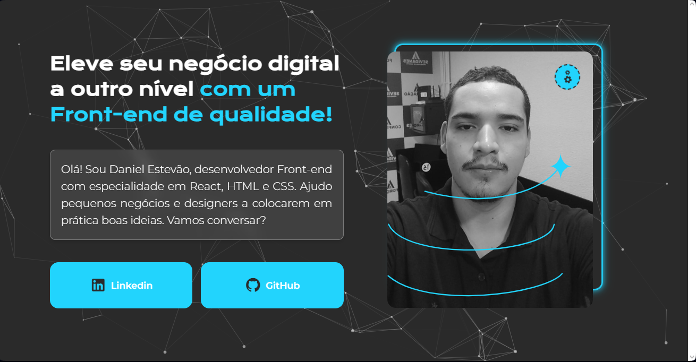
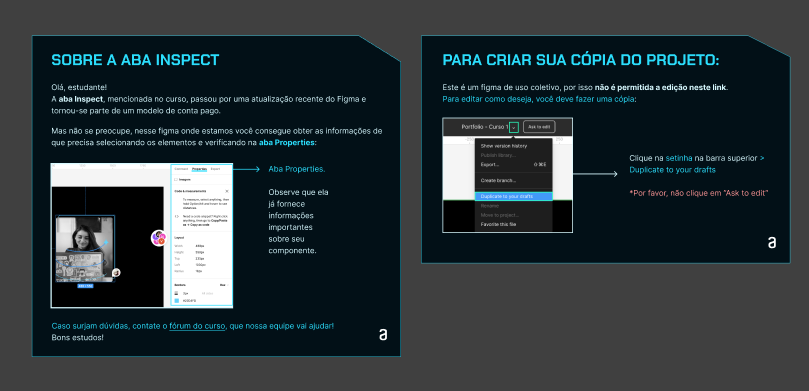
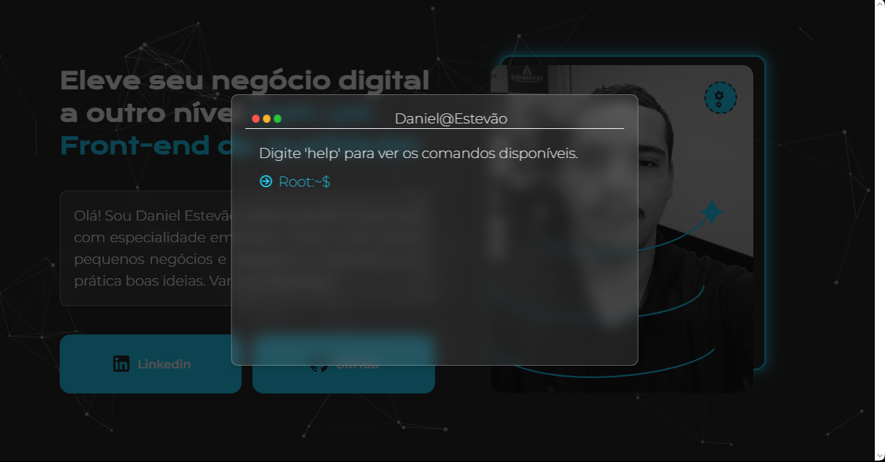

<h1 align="center">Carta de Apresentação - Dvizioon</h1>


<p align="center">
    
    
    
    
    
</p>




<p align="center">Projeto desenvolvido como desafio da Alura para praticar HTML, CSS, portfolio</p>


## Conteúdo

- [Funcionalidades](#funcionalidades)
- [Prototipo](#Prototipo)
- [Tecnologias Utilizadas](#tecnologias-utilizadas)
- [Estrutura do Projeto](#estrutura-do-projeto)
- [Como Executar](#como-executar)
- [Licença](#licença)


## Prototipo


[Vizualizar Prototipo](https://www.figma.com/design/sKfIDQtCpQBgxcKQ9aLE8z/Landing-Page---Apresentation?node-id=1-11&t=9egWD1X4uUtHzQyU-1)

## Funcionalidades

- **Janela do Terminal:** Simula uma janela de terminal com bordas, botões de controle (fechar, minimizar, maximizar) e um cabeçalho com título.
- **Entrada de Comando:** Permite ao usuário digitar comandos e exibe respostas simuladas.
- **Estilo Visual:** Utilização de partículas no fundo e efeitos visuais para uma experiência mais imersiva.


## Tecnologias Utilizadas

- **HTML:** Estrutura básica da página.
- **CSS:** Estilização do layout e dos componentes.
- **JavaScript:** Interatividade e manipulação do DOM.
- **SweetAlert2:** Para alertas personalizados (opcional).
- **Particles.js:** Para criar um efeito de fundo animado.
- **Plugins.js:** tilt para Efeito do Card

>[!IMPORTANT]
>os plugins que foram desenvolvidos nesse projeto são de autoria minha.

## Plugins

```javascript
/**
 * Plugin de Inclinação 3D para Elementos HTML
 * Criado por Daniel Estevão Martins Mendes
 * 
 * Este plugin adiciona um efeito de inclinação 3D responsivo
 * a um elemento HTML específico quando o mouse se move sobre ele.
 * 
 * @param {HTMLElement} element O elemento HTML alvo onde o efeito será aplicado.
 * @param {number} maxRotate Máxima inclinação em graus (padrão: 50).
 * @param {number} sensitivity Sensibilidade do movimento (padrão: 0.2).
 */
function addTiltEffect(element, maxRotate = 50, sensitivity = 0.2) {
    element.addEventListener('mousemove', e => {
        const rect = element.getBoundingClientRect();
        const centerX = rect.left + rect.width / 2;
        const centerY = rect.top + rect.height / 2;
        const mouseX = e.clientX;
        const mouseY = e.clientY;

        const distanceX = mouseX - centerX;
        const distanceY = mouseY - centerY;

        const percentX = distanceX / (rect.width / 2);
        const percentY = distanceY / (rect.height / 2);

        const rotateX = -maxRotate * percentY * sensitivity;
        const rotateY = maxRotate * percentX * sensitivity;

        element.style.transform = `perspective(1000px) rotateX(${rotateX}deg) rotateY(${rotateY}deg)`;
    });

    element.addEventListener('mouseleave', () => {
        element.style.transform = 'perspective(1000px) rotateX(0deg) rotateY(0deg)';
    });
}


const cardContent = document.querySelector('.card-content');
addTiltEffect(cardContent,100);

```
esse plugin permite que um elemento da pagina seja totalmente titiltado ao ser tocado em alguma parte criando um efieto de profundidade e 3D

>[!WARNING]
>Importante resaltar que esse plugin já existe no >Jquery criei a minha propia versão. dados não estão 
>tipado fortmente, se recomenda seguir a `doc` de tipos.

## Fonts ultilizadas

```css
/* latin-ext */
@font-face {
    font-family: 'Krona One';
    font-style: normal;
    font-weight: 400;
    font-display: swap;
    src: url(https://fonts.gstatic.com/s/kronaone/v14/jAnEgHdjHcjgfIb1ZcUyOIWg7cU.woff2) format('woff2');
    unicode-range: U+0100-02AF, U+0304, U+0308, U+0329, U+1E00-1E9F, U+1EF2-1EFF, U+2020, U+20A0-20AB, U+20AD-20C0, U+2113, U+2C60-2C7F, U+A720-A7FF;
}

/* latin */
@font-face {
    font-family: 'Krona One';
    font-style: normal;
    font-weight: 400;
    font-display: swap;
    src: url(https://fonts.gstatic.com/s/kronaone/v14/jAnEgHdjHcjgfIb1ZcUyNoWg.woff2) format('woff2');
    unicode-range: U+0000-00FF, U+0131, U+0152-0153, U+02BB-02BC, U+02C6, U+02DA, U+02DC, U+0304, U+0308, U+0329, U+2000-206F, U+2074, U+20AC, U+2122, U+2191, U+2193, U+2212, U+2215, U+FEFF, U+FFFD;
}

/* cyrillic-ext */
@font-face {
    font-family: 'Montserrat';
    font-style: italic;
    font-weight: 100;
    font-display: swap;
    src: url(https://fonts.gstatic.com/s/montserrat/v26/JTUFjIg1_i6t8kCHKm459Wx7xQYXK0vOoz6jq6R8WXV0poK5.woff2) format('woff2');
    unicode-range: U+0460-052F, U+1C80-1C88, U+20B4, U+2DE0-2DFF, U+A640-A69F, U+FE2E-FE2F;
}

```

## Registrador de Comandos

```javascript

    "help": {
        "action": () => {
            terminalOutput.innerHTML += '<p>Lista de comandos disponíveis:</p>';
            terminalOutput.innerHTML += '<ul>';
            Object.keys(commands).forEach(key => {
                terminalOutput.innerHTML += `<li>${key} - ${commands[key].description}</li>`;
            });
            terminalOutput.innerHTML += '</ul>';
        },
        "description": "Mostra esta mensagem de ajuda"
    },

```
>[!NOTA]
>para entrar no cmd e testa é necessario vc clicar no botão que está girando 
>

## Usando o Particles
```html
<script src="https://cdn.jsdelivr.net/particles.js/2.0.0/particles.min.js"></script>

<script>
    particlesJS.load('particles-js', 'json/particles.json', function () {
        console.log('particles.json loaded...');
    });
</script>

```
>[!NOTA]
>para usar alterar a estrutura morfologia do particles `json/particles.json`

## Licença
